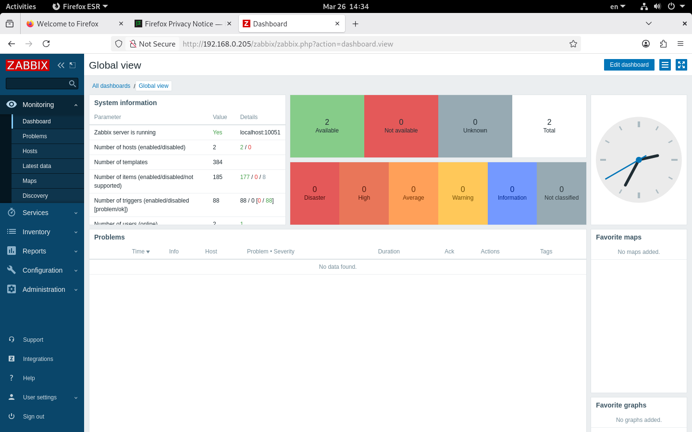
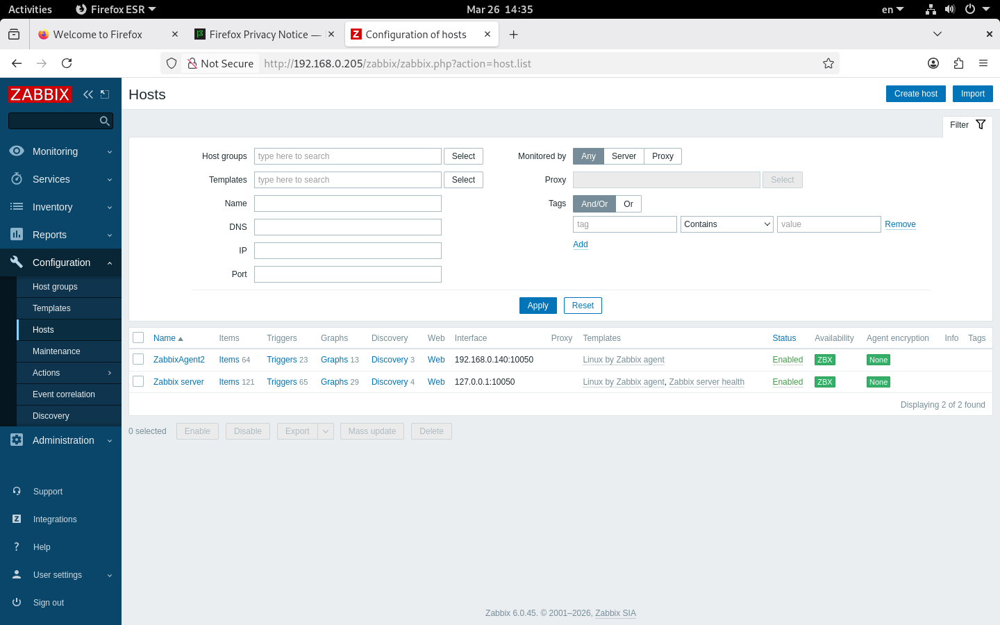
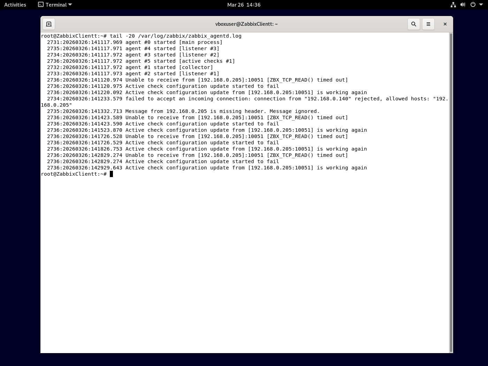
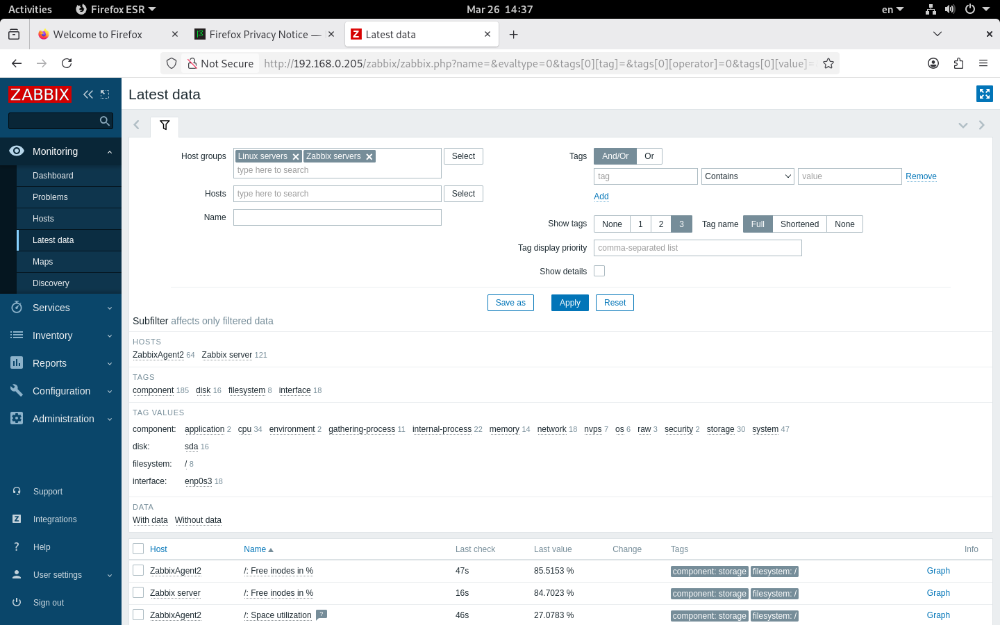

# zabbix-hw
Домашнее задание по Zabbix

## Задание 1: Установка Zabbix Server с веб-интерфейсом

### Использованные команды

```bash
# Установка PostgreSQL
apt update
apt install -y postgresql postgresql-contrib

# Установка репозитория Zabbix 6.0 для Debian 11
wget https://repo.zabbix.com/zabbix/6.0/debian/pool/main/z/zabbix-release/zabbix-release_6.0-4+debian11_all.deb
dpkg -i zabbix-release_6.0-4+debian11_all.deb
apt update

# Установка Zabbix Server и компонентов
apt install -y --allow-downgrades zabbix-server-pgsql zabbix-frontend-php php-pgsql zabbix-apache-conf zabbix-sql-scripts zabbix-agent

# Настройка базы данных PostgreSQL
sudo -u postgres psql -c "ALTER USER zabbix WITH PASSWORD 'zabbix123';"
zcat /usr/share/zabbix-sql-scripts/postgresql/server.sql.gz | sudo -u zabbix psql zabbix

# Настройка конфигурации Zabbix Server
# В /etc/zabbix/zabbix_server.conf указаны:
# DBHost=localhost
# DBName=zabbix
# DBUser=zabbix
# DBPassword=zabbix123

# Запуск сервисов
systemctl restart zabbix-server zabbix-agent apache2
systemctl enable zabbix-server zabbix-agent apache2

# Настройка часового пояса в PHP
# В /etc/php/7.4/apache2/php.ini:
# date.timezone = Europe/Moscow
```

Результат установки
Скриншот авторизации в веб-интерфейсе Zabbix:



---

## Задание 2: Установка Zabbix Agent на два хоста

Хост 1: ZabbixServer (сервер Zabbix)
Агент установлен. Конфигурация /etc/zabbix/zabbix_agentd.conf:

```
ini
Server=127.0.0.1
ServerActive=127.0.0.1
Hostname=ZabbixServer
```

Хост 2: ZabbixClientt (вторая виртуальная машина)
Команды для установки агента на второй хост:

```
# Установка репозитория
wget https://repo.zabbix.com/zabbix/6.0/debian/pool/main/z/zabbix-release/zabbix-release_6.0-4+debian11_all.deb
dpkg -i zabbix-release_6.0-4+debian11_all.deb
apt update

# Установка агента
apt install -y zabbix-agent

# Настройка конфигурации /etc/zabbix/zabbix_agentd.conf
# Server=192.168.0.205   (IP Zabbix Server)
# ServerActive=192.168.0.205
# Hostname=ZabbixClientt

# Запуск агента
systemctl restart zabbix-agent
systemctl enable zabbix-agent
```

Список хостов в Zabbix
Скриншот страницы Configuration > Hosts с добавленными хостами:



Лог Zabbix Agent на втором хосте
Скриншот лога агента, подтверждающий работу с сервером:



Данные от агентов
Скриншот раздела Monitoring > Latest data для обоих хостов:



```
Сетевые настройки
Хост	IP адрес	Роль
ZabbixServer	192.168.0.205	Zabbix Server + Agent
ZabbixClientt	192.168.0.140	Zabbix Agent
```
